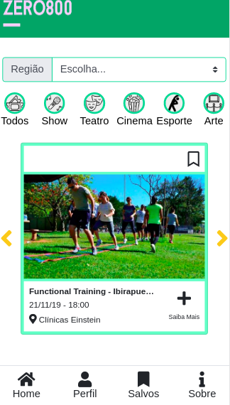
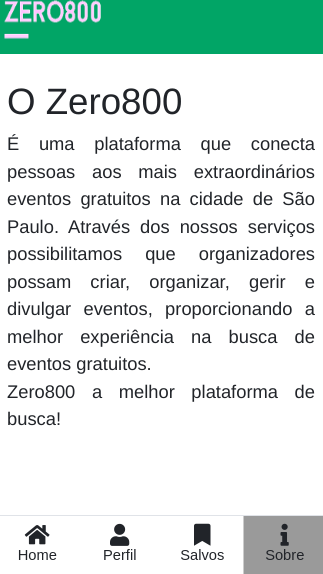

# Zero0800

   É uma plataforma que conecta pessoas aos mais extraordinários eventos gratuitos na cidade de São Paulo. Através dos nossos serviços possibilitamos que organizadores possam criar, organizar, gerir e divulgar eventos, proporcionando a melhor experiência na busca de eventos gratuitos. 
   Zero800 a melhor plataforma de busca!

## Imagens 

  

## Tecnologias utilizadas

- JavaScript
- Bootstrap
- Eslint
- Firebase
- Api mapa Hero

## Ferramentas utilizadas
- Formulario de pesquisa do google: Para validação de pesquisa
- Trello: Para planejamento e organização das tasks

